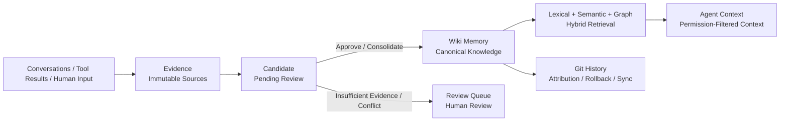
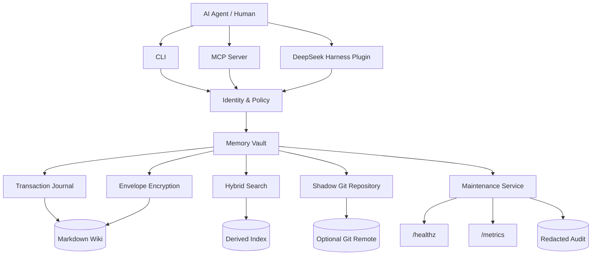

<div align="center">


# MemoBranch

### Memory that branches with your agents.

**English** · [简体中文](README_CN.md)

Auditable, searchable, portable long-term memory for AI agents

**Markdown is the source of truth · Git tracks every change · LLMs provide optional enhancements**

<p>
  
  
  
  
  
  
  <a href="https://github.com/sens-io/memobranch/actions/workflows/ci.yml"></a>
  <a href="openspec/changes/align-karpathy-llm-wiki/verification.md"></a>
  
  <a href="https://github.com/sens-io/memobranch/stargazers"></a>
</p>

<p>
  <a href="#-why-memobranch">Why MemoBranch</a> •
  <a href="#-core-capabilities">Capabilities</a> •
  <a href="#-quick-start">Quick Start</a> •
  <a href="#-web-management">Web Console</a> •
  <a href="#-how-it-works">Architecture</a> •
  <a href="#-deepseek-harness-plugin">DeepSeek Harness</a> •
  <a href="#-mcp-integration">MCP</a> •
  <a href="#-production-operations">Operations</a>
</p>

</div>

---

MemoBranch is a local-first long-term memory layer designed for AI agents and production use cases. It organizes conversational evidence, candidate knowledge, and canonical memories into a human-readable Markdown Wiki, with Git providing versioning, attribution, rollback, and cross-machine synchronization.

Inspired by [OpenKnowledge](https://github.com/inkeep/open-knowledge)'s Git + LLM Wiki approach, MemoBranch is an independent implementation and includes none of its source code. Development follows the [OpenSpec](https://github.com/Fission-AI/OpenSpec) workflow: proposal → specs → design → tasks → implementation → verification. Acceptance status for each capability is determined by the verification record for the corresponding version.

> **Core design constraint:** The LLM Wiki follows [Karpathy's method](https://gist.github.com/karpathy/442a6bf555914893e9891c11519de94f): continuously compile and maintain interconnected, source-backed knowledge—not just vector search. Incremental cross-source compilation, explicit answer filing, and semantic Lint have passed local functional acceptance and isolated independent review. See the [core design](docs/design/llm-wiki-core.md) and [criterion-by-criterion verification record](openspec/changes/align-karpathy-llm-wiki/verification.md). Local acceptance does not establish GitHub-hosted CI results, real-model quality, or production release validation.

> [!IMPORTANT]
> An LLM is not a source of truth. Capture, review, Git versioning, recovery, Chinese/English retrieval, and DeepSeek Harness and MCP integration remain fully functional without a model API.

For the journey from raw sources to a maintained knowledge network, see the [Ingest / Query / Lint guide](docs/wiki.md): inspect a multi-page plan before explicitly applying it. Ordinary queries are read-only; answer filing and Lint repairs require separate authorization. Model-driven compilation, question answering, and semantic analysis require a chat model; structural checks and the existing memory workflows do not.

## 💡 Why MemoBranch

Agent memory is often just a vector database, leaving basic questions unanswered: Where did this information come from? Why is it trustworthy? Who changed it? How are conflicts handled?

MemoBranch turns memory into a governed knowledge chain:



| Common question | How MemoBranch handles it |
| --- | --- |
| “Where did this memory come from?” | Every canonical memory retains evidence references and Git history |
| “What if new information conflicts with existing knowledge?” | It enters the review queue instead of silently overwriting existing knowledge |
| “Can an agent declare itself an administrator?” | No. Identity and permissions are determined by server-side configuration |
| “Can secrets end up in Git or a vector database?” | Sensitive content is envelope-encrypted, logical keys use opaque paths, and protected content is excluded from indexes and generated files |
| “What if the process crashes halfway through a write?” | A write-ahead transaction journal supports exact rollback or complete replay |
| “Can I still search if the model API goes down?” | Retrieval falls back to deterministic Chinese/English lexical search |

## ✨ Core Capabilities

| | Capability | Description |
| :---: | --- | --- |
| 📚 | **Git-native Wiki** | Markdown is authoritative; every logical change has an attributed Git commit |
| 🕸️ | **Cross-source knowledge compilation** | Rules and catalogs guide incremental maintenance of source, entity, concept, synthesis, comparison, and query pages; multi-page changes commit atomically |
| 💬 | **Source-backed answers and filing** | Navigate before reading pages, bind answers to actual cited revisions, and preserve source restrictions and uncertainty when explicitly saving |
| 🧭 | **Structural and semantic maintenance** | Structural checks work without a model; models propose evidence-backed maintenance suggestions, with separate authorization required for repairs |
| 🧾 | **Evidence-driven memory** | `evidence → candidates → wiki`, preserving sources, confidence, conditions, and revision chains |
| 🛡️ | **Server-side access control** | Authorize by permission, scope, sensitivity, and tenant before reading content |
| 🔐 | **Policy-driven envelope encryption** | Per-record DEKs and AES-256-GCM for any sensitivity level selected by policy, with cryptographic erasure |
| 🔎 | **Hybrid retrieval** | CJK/English lexical search, optional embeddings, Wiki link expansion, and incremental indexing |
| 🔄 | **Remote Git synchronization** | Ahead/behind/diverged states, fast-forward updates, regular merges, conflict aborts, and controlled pushes |
| 🧯 | **Crash recovery** | Journal multi-file writes before atomic replacement; automatically roll back or replay on startup |
| 🔌 | **CLI + agent plugins** | CLI, MCP, and a native DeepSeek Harness plugin share stable errors and least-privilege contracts |
| 📈 | **Production observability** | A single-instance maintenance service, `/healthz`, Prometheus `/metrics`, and redacted audit logs |
| 🧩 | **OpenSpec-driven development** | Traceable proposals, specifications, designs, tasks, verification evidence, and archives |

> [!NOTE]
> MemoBranch is a local service with one tenant per vault. The local Web console provides structured management, not arbitrary file editing. It does not include a hosted control plane, multi-tenant database, distributed write consensus, or automatic semantic conflict resolution.

## 🚀 Quick Start

### Requirements

- Node.js 20 or later
- Git available on `PATH`

### Installation

Install the published package from [npm](https://www.npmjs.com/package/memobranch); no source checkout or build is required:

```bash
npm install -g memobranch
memobranch --help
```

For a pinned installation, use `npm install -g memobranch@1.1.0`. The package provides `memobranch` and `memobranch-mcp`, plus the equivalent aliases `amem` and `amem-mcp` used in the examples below.

#### From Source (Development)

```bash
git clone https://github.com/sens-io/memobranch.git
cd memobranch
npm ci
npm run build
npm link
```

### Create Your First Memory in 60 Seconds

```bash
# 1. Initialize a vault
amem init ~/my-agent-memory --name personal-agent --json

# 2. Capture raw evidence
amem capture "Please remember: respond concisely in Chinese by default" \
  --root ~/my-agent-memory \
  --scope user \
  --sensitivity internal \
  --json

# 3. Create a candidate for review
amem propose "The user prefers concise replies in Chinese." \
  --root ~/my-agent-memory \
  --key "Reply language and style" \
  --kind preference \
  --scope user \
  --confidence 0.95 \
  --explicit \
  --json

# 4. Consolidate into canonical Wiki memory according to policy
amem consolidate --root ~/my-agent-memory --json

# 5. Search and generate agent context
amem search "How does the user prefer responses?" --root ~/my-agent-memory --json
amem context "How should I reply to this user?" --root ~/my-agent-memory
```

Check vault health:

```bash
amem doctor --root ~/my-agent-memory --json
```

## 🏗️ How It Works

### System Architecture



### Vault Layout

```text
vault/
├── agent-memory.json       # v2 configuration
├── AGENTS.md               # Agent usage constraints
├── .gitignore              # Keep .amem runtime state out of an enclosing Git repository
├── evidence/               # Immutable raw evidence
├── candidates/             # Candidates awaiting review
├── wiki/                   # Canonical memory
├── MEMORY.md               # Non-confidential resident cards (generated)
├── INDEX.md                # Non-confidential catalog (generated)
├── log.md                  # Git audit summary without document bodies
└── .amem/
    ├── git/                # Shadow Git metadata
    ├── keys.json           # Wrapped data keys, excluded from Git
    ├── transactions/       # Write-ahead transaction journals
    ├── search-index.json   # Rebuildable lexical index, excluded from Git
    ├── embeddings.json     # Rebuildable vector cache, excluded from Git
    ├── audit.jsonl         # Structured, redacted audit log
    └── metrics.json        # Bounded counters and gauges
```

### Memory Governance Rules

- `evidence/` is append-only raw evidence; stable hashes prevent duplicate capture.
- `candidates/` holds extracted knowledge awaiting review. Conflicting or low-confidence content is not automatically promoted to canonical memory.
- `wiki/` contains only reviewed canonical memory and is the authoritative source for retrieval and context generation.
- A `procedure` requires at least two pieces of evidence by default.
- All evidence references, promotion/supersession relationships, and managed document IDs undergo cross-file integrity checks.
- Different content with the same `scope + kind + key` creates an explicit conflict.
- Ordinary retrieval excludes `conflicted` records. Rejecting the last conflicting candidate restores the original canonical memory.
- LLM-extracted content inherits the evidence's scope, and its sensitivity can only increase, never decrease.
- `forget` is an auditable revocation that preserves history; `erase` additionally destroys the local wrapped data key.

## 🔍 Search and LLM Enhancements

Basic retrieval requires no model. The system maintains a persistent incremental index of Latin words, Chinese characters, and CJK bigrams, with reproducible rankings for the same vault.

Configure an OpenAI-compatible endpoint to enable automatic extraction, memory-grounded answers, and semantic retrieval:

```bash
export AMEM_LLM_API_KEY="..."
export AMEM_LLM_MODEL="gpt-4.1-mini"
export AMEM_LLM_BASE_URL="https://api.openai.com/v1"

amem capture "Please remember: respond concisely in Chinese by default" \
  --extract \
  --root ~/my-agent-memory \
  --json

amem ask "How should I respond?" --root ~/my-agent-memory --json
```

After setting an embedding model in `index.embeddingModel` in `agent-memory.json`:

```bash
amem reindex --semantic --root ~/my-agent-memory --json
amem search "Response preferences" --semantic --root ~/my-agent-memory --json
```

If the vector service is unavailable, requests still return lexical and graph-based results and report `semanticStatus: "degraded"`. Encrypted documents are never sent to the embedding API, even if the encryption policy is later changed.

## 🔐 Security and Confidential Memory

### Envelope Encryption

Before first reading or writing records that require encryption under policy, supply a 32-byte master key. The default policy covers `sensitive` and `secret`, and can be extended to `internal` or `public`:

```bash
export AMEM_MASTER_KEY="$(openssl rand -hex 32)"

amem capture "Confidential content visible only to authorized agents" \
  --root ~/my-agent-memory \
  --sensitivity secret \
  --json
```

Each confidential record uses a separate data key. Its complete logical metadata and body are authenticated and encrypted with AES-256-GCM. Git-tracked files retain only a minimal, non-sensitive envelope; filenames use opaque IDs, and commit subjects do not contain logical keys.

> [!WARNING]
> Never put `AMEM_MASTER_KEY` in the repository, configuration, remote URLs, or shell history. In production, provide it through an OS keychain, secret manager, or secure process-level injection.

Key recovery considerations:

- `.amem/keys.json` stores data keys wrapped by the master key and is not synchronized through Git.
- Initialization and subsequent migrations maintain an `.amem/` exclusion in the vault's `.gitignore`, preventing accidental tracking by an enclosing Git repository.
- Reading confidential memory on another host requires separately and securely transferring both the master key and `.amem/keys.json`.
- Losing either makes the corresponding historical ciphertext unrecoverable.
- `erase` only guarantees that this vault can no longer decrypt the record. It cannot delete external backups, exported plaintext, or third-party copies.
- The reason for `erase` is normalized and stored as a SHA-256 commitment; its plaintext never appears in Git. Legacy recovery records without a reason digest are explicitly marked as unrecorded.
- Policy-encrypted records are excluded from `MEMORY.md`, `INDEX.md`, persistent indexes, vector APIs, audit body content, and metric labels. Recovery journals are encrypted under the same policy.
- Evidence IDs bind scope, sensitivity, source URI, and body. Remotes may only append evidence, not rewrite or delete existing evidence.

### Permission Model

The MCP principal is constructed entirely from the server environment. Callers cannot impersonate another identity or elevate privileges through tool arguments.

| Permission | Purpose |
| --- | --- |
| `read` | Search, read, and generate context |
| `write` | Capture evidence and create candidates |
| `review` | Consolidate, approve, reject, and revoke |
| `sync` | Inspect remote status and synchronize |
| `maintain` | Recover, index, check health, and run the service |
| `admin` | Includes all permissions and allows cryptographic erasure |

Authorization checks `scope`, maximum `sensitivity`, and `tenantId` together, before decryption, scoring, graph expansion, summary generation, or embedding requests. Every non-admin principal must be bound to the `tenantId` in the vault configuration; only the implicit local administrator may omit it.

## 🐋 DeepSeek Harness Plugin

MemoBranch integrates directly into DeepSeek Harness's tool registry as a native Cordis plugin, without a separate MCP subprocess. It follows the Harness lifecycle, supports hot replacement when configuration changes, and lets Cordis automatically unregister all tools on unload.

The plugin has been verified with `@deepseek-ai/dsh-tools@0.1.2-rc.1`. Its declared compatibility range, `^0.1.2-rc.1`, includes that prerelease and subsequent compatible stable `0.1` versions.

> [!NOTE]
> MemoBranch itself supports Node.js 20+. The dependency chain of the official `@deepseek-ai/dsh@0.1.2-rc.1` requires Node.js 22.19+. Follow the `engines` declaration of the Harness version you install.

### Install from npm

With DeepSeek Harness already installed, add MemoBranch directly to a Harness profile. A separate global MemoBranch installation is not required:

```bash
dsh plugin --profile personal-agent add memobranch
dsh --profile personal-agent --dump-config
dsh --profile personal-agent
```

### Install from Local Source

Build MemoBranch, then install the project directory into a Harness profile:

```bash
cd /absolute/path/to/memobranch
npm ci
npm run build

dsh plugin --profile personal-agent add /absolute/path/to/memobranch
dsh --profile personal-agent --dump-config
dsh --profile personal-agent
```

When installing from GitHub, pin a commit:

```bash
dsh plugin --profile personal-agent add github:sens-io/memobranch#<commit-sha>
```

A Git installation builds TypeScript through `prepare`. With pnpm 10 or later, explicitly allow the `memobranch` build script in the profile's `pnpm-workspace.yaml`. This authorizes dependency code to run during installation, so grant it only to trusted, pinned commits.

### Configuration

Identity, permissions, tenant, keys, and provider credentials are still injected by the launching process through the `AMEM_*` environment variables listed below. Models cannot override them through tool arguments. If `vaultRoot` is empty, it falls back to `AMEM_VAULT`, then the current working directory.

To override plugin defaults, override the same plugin entry in the profile's `cordis.patch.yml`:

```yaml
- id: memobranch-memory
  name: memobranch/deepseek-harness
  config:
    vaultRoot: /absolute/path/to/memory-vault
    defaultScope: project
    defaultSensitivity: internal
    defaultSearchLimit: 8
    defaultMaxContextCharacters: 12000
```

Schemastery validates configuration at load time. `defaultSearchLimit` must be within `1..50`, and `defaultMaxContextCharacters` within `500..50000`. Invalid configuration prevents all tool registration.

### Least-Privilege Tool Set

The plugin limits model-visible tools according to `AMEM_PERMISSIONS`, while `MemoryVault` authorizes each operation again at execution time:

| Permission | Visible tools |
| --- | --- |
| `read` | `memory_context`, `memory_search`, `memory_get`, `memory_version`, `memory_config`, `memory_policy`, `memory_history` |
| `write` | `memory_capture`, `memory_propose` |
| `review` | `memory_consolidate`, `memory_review`, `memory_forget` |
| `admin` | All tools, including `memory_erase` |
| `maintain` | `memory_doctor`, `memory_recover`, `memory_reindex`, `memory_maintenance` |
| `sync` | `memory_remote_status`, `memory_remote_sync` |

All tools declare typed arguments and standardized output through the official `defineTool` API. `write`, `review`, `maintain`, and `sync` can each be granted independently: internal reads needed by an operation use that operation's authority without exposing `memory_get` or `memory_search`. Scope, sensitivity, and tenant checks remain in force. Automatic synchronization during maintenance additionally requires `sync`.

Cancellation is isolated per invocation and does not stop model requests belonging to other sessions. Writes waiting for a lock or not yet in the commit phase stop and roll back. Transactions already in the commit phase, recovery, and cryptographic erasure settle safely before returning `OPERATION_CANCELLED`. If a commit was produced, the error's `details.committed` lists the operation and commit ID. No extraction or subsequent write starts after cancellation. Plugin unload cancels and awaits cleanup of all calls it owns.

Git commands run for at most 30 seconds by default, configurable through `AMEM_GIT_TIMEOUT_MS` (`1..300000` milliseconds). Cancellation or timeout terminates the associated transport processes. A confirmed successful push is not rolled back locally. If a push is interrupted before confirmation, the remote outcome may be unknown; inspect remote status before retrying. Agents should call `memory_context` before tasks that need long-term context.

## 🖥 Web Management

The local management console offers a dashboard, authorized memory/evidence browsing, capture and candidate review, Wiki workflows, configuration, health checks and Git history.

> [!NOTE]
> Available starting with npm version `1.1.0`. Install or upgrade, then start the console:

```bash
npm install -g memobranch@1.1.0
memobranch web --root /absolute/path/to/memory-vault --port 0
```

Initialize the vault first with `memobranch init /absolute/path/to/memory-vault` if needed. Open the printed `http://127.0.0.1:<port>` URL, then enter the separately printed token. `--port 0` selects a free port; a fixed port such as `--port 3210` is also supported. Stop with Ctrl+C.

Maintainers: [one-command npm release and recovery guide](https://github.com/sens-io/memobranch/blob/main/docs/releasing.md).

- **Memory:** filter and paginate records, inspect provenance, capture evidence, propose, approve/reject and revoke memories.
- **LLM Wiki:** browse pages, prepare ingestion plans, run read-only queries, explicitly prepare answer-filing plans, run structural/semantic lint and separately approve plans. Edit purpose/rules with revision checks.
- **Configuration:** edit non-secret operational settings with administrator authorization and stale-write protection. Identity, tenant, credentials, encryption policy and remote URLs stay outside the browser.
- **Operations:** inspect health and history, rebuild the lexical index, recover transactions and explicitly synchronize an already-configured Git remote. Web mode does not start the background maintenance scheduler.

The Chinese-language UI is bundled locally with no CDN dependencies. It binds only to `127.0.0.1`, requires a token plus exact Host/Origin checks, and inherits the launching process's `AMEM_*` identity and access restrictions. Keep the token private; it is held only in page memory and rotates on restart. Desktop/browser refresh requires entering it again. Do not expose this console through a public proxy. Irreversible key erasure remains CLI-only in the Web workflow.

## 🔌 MCP Integration

After `npm install -g memobranch`, add the following configuration to an MCP-compatible agent tool. Initialize the vault first (see Quick Start), replace its path with an actual absolute path, and copy its `tenantId` from `agent-memory.json` into `AMEM_TENANT_ID`:

```json
{
  "mcpServers": {
    "agent-memory": {
      "command": "memobranch-mcp",
      "args": [
        "/absolute/path/to/memory-vault"
      ],
      "env": {
        "AMEM_ACTOR_ID": "workspace-agent",
        "AMEM_ACTOR_NAME": "Workspace Agent",
        "AMEM_PERMISSIONS": "read,write,review",
        "AMEM_ALLOWED_SCOPES": "user,project",
        "AMEM_MAX_SENSITIVITY": "internal",
        "AMEM_TENANT_ID": "copy-from-agent-memory-json"
      }
    }
  }
}
```

The MCP client must be able to find Node.js, Git, and `memobranch-mcp` on its `PATH`. Desktop clients may not inherit your shell's `PATH`; configure it explicitly if needed. You can locate the installed executable with `command -v memobranch-mcp` (Windows: `where memobranch-mcp`).

For a source installation, keep the same `env` settings and use `"command": "node"` with `"args": ["/absolute/path/to/memobranch/dist/mcp.js", "/absolute/path/to/memory-vault"]` after building.

### MCP Tools

| Category | Tools |
| --- | --- |
| Writing | `memory_capture`, `memory_propose` |
| Retrieval | `memory_search`, `memory_context`, `memory_get` |
| Review | `memory_consolidate`, `memory_review`, `memory_forget`, `memory_erase` |
| Operations | `memory_doctor`, `memory_recover`, `memory_reindex`, `memory_maintenance` |
| Git | `memory_history`, `memory_remote_status`, `memory_remote_sync` |
| Information | `memory_version`, `memory_config`, `memory_policy` |

All MCP errors return stable error codes and `isError: true`, without exposing stack traces or secrets or terminating the server. Agents should call `memory_context` before tasks that depend on long-term context.

## 🌐 Remote Git Synchronization

Remote authentication is delegated entirely to a Git credential helper or SSH agent. The CLI and MCP do not accept token arguments. URLs containing userinfo, query strings, or fragments, and SCP-style URLs with a username other than `git`, are rejected.

```bash
amem remote set git@github.com:org/memory-vault.git \
  --root ~/my-agent-memory \
  --name origin \
  --branch main \
  --json

amem remote status --root ~/my-agent-memory --json
amem remote sync --root ~/my-agent-memory --push --json
```

Synchronization proceeds in this order: recover unfinished transactions → check the working tree → fetch → calculate ahead/behind → fast-forward or regular merge → validate append-only evidence → rebuild derived state → validate schemas, references, symlinks, confidential-data encoding, and health → optionally push.

If a content conflict, post-merge validation failure, or transport failure occurs before a successful push, the system restores the previous local HEAD, managed working tree, and synchronization state. It never force-pushes automatically. If the remote has accepted a push but the final status refresh fails, the local repository retains the pushed commit matching the remote, keeping retries idempotent.

## 🩺 Production Operations

### One-Off Maintenance

```bash
amem maintenance --root ~/my-agent-memory --json
```

Each maintenance cycle performs transaction recovery, expiration processing, incremental indexing, health checks, and optional remote synchronization in sequence. Repeating a cycle on unchanged state does not create meaningless Git commits.

### Long-Running Service

```bash
amem serve \
  --root ~/my-agent-memory \
  --host 127.0.0.1 \
  --port 9464

curl http://127.0.0.1:9464/healthz
curl http://127.0.0.1:9464/metrics
```

- The HTTP service accepts only loopback bind addresses.
- `.amem/service.json` maintains a single-instance lease; a live process cannot be displaced.
- Leases include an instance ownership token. Only the owner can update or release a lease. A late startup failure cleans up listeners, ports, and the instance's own lease.
- Changes in managed directories trigger debounced incremental indexing. If native file watching is unavailable, the service falls back to bounded polling.
- `SIGTERM` / `SIGINT` wait for active transactions to finish safely.
- If the latest `doctor` result is unhealthy or a maintenance cycle fails, `/healthz` returns HTTP 503 with `status: "unavailable"`.
- Metrics use fixed names and bounded labels, excluding document bodies, keys, credentials, and source URIs.

Use systemd, launchd, or a container orchestrator to manage the process, and inject configuration through a secure environment.

<details>
<summary><strong>Environment Variable Reference</strong></summary>

| Variable | Meaning | Default |
| --- | --- | --- |
| `AMEM_VAULT` | Vault path for MCP / DeepSeek Harness | Current directory |
| `AMEM_ACTOR_ID` | Principal ID for Git and auditing | `agent` |
| `AMEM_ACTOR_NAME` | Principal name for Git and auditing | Principal ID |
| `AMEM_ACTOR_EMAIL` | Optional Git email | Empty |
| `AMEM_PERMISSIONS` | Permission list | `read` for MCP |
| `AMEM_ALLOWED_SCOPES` | Allowed scope list | All |
| `AMEM_MAX_SENSITIVITY` | Maximum sensitivity | `internal` |
| `AMEM_TENANT_ID` | Required for non-admins; copy `tenantId` from the vault configuration | None; access is denied if missing |
| `AMEM_MASTER_KEY` | Master key for envelope encryption | Empty; confidential operations fail closed |
| `AMEM_LLM_API_KEY` | OpenAI-compatible API credential | Empty |
| `OPENAI_API_KEY` | Fallback source for `AMEM_LLM_API_KEY` | Empty |
| `AMEM_LLM_MODEL` | Extraction and question-answering model | `gpt-4.1-mini` |
| `AMEM_LLM_BASE_URL` | OpenAI-compatible API base URL | `https://api.openai.com/v1` |
| `AMEM_EMBEDDING_MODEL` | Optional embedding model | Empty; lexical search only |
| `AMEM_LLM_TIMEOUT_MS` | Total timeout for a single provider request | `30000` |
| `AMEM_LLM_MAX_RESPONSE_BYTES` | Maximum provider response size in bytes | `2000000` |
| `AMEM_LLM_MAX_RETRIES` | Bounded retries for 429/5xx/network failures | `1` |
| `AMEM_GIT_TIMEOUT_MS` | Timeout for each Git command and its transport processes (1–300000 ms) | `30000` |

See [`.env.example`](./.env.example) for a complete example.

</details>

<details>
<summary><strong>Recovery Runbook</strong></summary>

1. Stop all writers and service processes, and preserve a complete copy of the vault and `.amem/`.
2. Run `amem doctor --root <vault> --json` and record configuration, Git, index, and transaction status.
3. Run `amem recover --root <vault> --json`. Recovery first restores unfinished synchronization snapshots, then rolls back `writing` transactions or replays `ready` transactions. Further writes remain blocked until recovery succeeds.
4. Run `amem reindex --root <vault> --json` to rebuild missing or corrupt indexes from Markdown.
5. Run `amem remote status --root <vault> --json`. If histories have diverged, inspect them manually; do not bypass safeguards with a force push.
6. Run `doctor` again and resume the service and automatic synchronization only after it reports `healthy: true`.

Git object corruption blocks synchronization. Restore `.amem/git` from a trusted remote or backup; do not delete authoritative Markdown from the working tree. A missing master key or wrapped key causes the system to fail closed; restore it from a controlled key backup.

When synchronization definitively fails, the original HEAD, managed files, and synchronization state are restored. If reset or cleanup fails, `.amem/sync-intent.json` is retained so recovery can be retried after resolving resource contention or filesystem faults. Pushes already accepted by the remote are not rolled back. If a transport interruption leaves the outcome unknown, recovery also requires `sync` permission to confirm that the remote contains the commit; `maintain` alone never accesses the remote. If confirmation is impossible, recovery remains blocked. Inspect the remote and backups instead of deleting recovery records or force-pushing. To preserve this boundary, a synchronization operation supports only one push destination.

</details>

## ⌨️ CLI Quick Reference

| Task | Command |
| --- | --- |
| Initialize | `amem init [path] [--name NAME]` |
| Capture / extract | `amem capture <text\|-> [--extract]` / `amem extract <evidence-id>` |
| Create a candidate | `amem propose <statement> --key KEY` |
| Review | `amem consolidate` / `approve` / `reject` |
| Forget / erase | `amem forget <id\|key>` / `amem erase <id\|key>` |
| Search / context | `amem search <query>` / `context` / `ask` / `get` |
| Diagnose / recover | `amem doctor` / `recover` / `reindex` / `maintenance` |
| Remote | `amem remote set` / `status` / `sync` / `remove` |
| Service | `amem serve [--host 127.0.0.1] [--port 0]` |
| Web console (source build) | `amem web --root PATH [--port 0]` |
| Information | `amem version` / `config` / `policy` / `history` |
| Wiki compilation / review | `amem wiki ingest <evidence-id>` / `wiki apply --file PLAN.json` |
| Wiki navigation / filing | `amem wiki catalog` / `wiki query <question>` / `wiki file --file ANSWER.json --title TITLE` |
| Wiki rules / maintenance | `amem wiki rules` / `set-rules` / `migrate` / `lint [--semantic]` / `revoke` |

All commands support `--root PATH`. Use `--json` consistently in automation.

## 🔁 v1 → v2 Migration

```bash
amem config migrate --root ~/my-agent-memory --json
```

Migration first creates `agent-memory.json.v1.bak`, then adds tenant, permission, index, remote, maintenance, and limit configuration. Legacy evidence digests are upgraded while preserving their original IDs, paths, and references. After expanding `policy.requireEncryptionFor`, existing plaintext is rewritten into encrypted envelopes only through explicit migration with `AMEM_MASTER_KEY` supplied.

When encountering a future configuration version, `doctor` can still provide read-only diagnostics, but all writes fail closed with `CONFIG_VERSION_UNSUPPORTED`.

## 🧪 Development and Release Gates

```bash
npm run check
npm pack --dry-run
npm run test:package
npm audit --omit=dev
OPENSPEC_TELEMETRY=0 openspec validate --all --strict
```

| Gate | Verification requirement |
| --- | --- |
| TypeScript build | Strict compilation passes |
| CLI / MCP / DeepSeek Harness / Vault tests | The full suite passes on the target commit, covering both `main` and `master` Git defaults |
| 1,000-document index performance gate | Indexing and retrieval meet the test budgets |
| Package | Install the packed artifact into an independent consumer and verify exports, the bundle, and real Harness calls |
| Dependency vulnerability audit | Rerun the production dependency audit at release time |
| OpenSpec strict validation | Specifications, changes, and verification records remain consistent |

Results are tied to a specific commit and environment. This static table is not a substitute for the latest [GitHub CI](https://github.com/sens-io/memobranch/actions) results or independent review.

Tests cover tenant isolation, policy-driven encryption and migration, recovery journals and embedding isolation, cryptographic erasure, canonical-state index revalidation, full schema and cross-document references, symlink rejection, evidence immutability, failure windows before and after pushes, concurrent locks/leases/metrics, transaction rollback and replay, conflict resolution workflows, CJK retrieval, provider boundaries, maintenance endpoints, and graceful shutdown.

Specifications and archived records live in [`openspec/`](./openspec). See [`production-audit-remediation`](./openspec/changes/archive/2026-09-03-production-audit-remediation) and [`independent-audit-remediation`](./openspec/changes/archive/2026-09-03-independent-audit-remediation) for production audits, and [`close-final-production-gaps`](./openspec/changes/archive/2026-09-04-close-final-production-gaps) for the final production-readiness closeout.

## 🧱 Threat Model and Boundaries

**This implementation protects against:** identity spoofing by MCP or Harness callers; unauthorized scope/sensitivity access; confidential plaintext entering Git, indexes, logs, metrics, or recovery journals; accidental tracking of runtime state by an enclosing Git repository; symlinks in managed paths; partial writes; duplicate execution; persisted remote URL credentials; common synchronization conflicts; and model service unavailability.

**This implementation does not protect against:** attackers with full control of the host or process memory; malicious local administrators; already exported plaintext; OS or backup leaks; compromised Git/LLM supply chains; traffic analysis; or copies already held by third parties.

Production deployments still require disk encryption, least-privilege file permissions, process isolation, key rotation, controlled backups, and supply-chain scanning.

## 🙏 Acknowledgments

- [Karpathy — LLM Wiki](https://gist.github.com/karpathy/442a6bf555914893e9891c11519de94f): The core approach to persistent incremental knowledge compilation and Ingest / Query / Lint.
- [nashsu/llm_wiki](https://github.com/nashsu/llm_wiki): An implementation reference for Wiki workflows and acceptance methods; no source code was copied.
- [OpenKnowledge](https://github.com/inkeep/open-knowledge): Architectural inspiration for a Git-driven local Markdown / LLM Wiki.
- [OpenSpec](https://github.com/Fission-AI/OpenSpec): Specification-driven production development and archival workflows.
- [Model Context Protocol](https://modelcontextprotocol.io/): A standard tool interface between agents and the memory service.
- [DeepSeek Harness](https://deepseek-harness.github.io/deepseek-harness/develop/basic/): Native Cordis plugins, configuration, and typed tool interfaces.

---

<div align="center">

**Built for agents that should remember — without forgetting where the truth came from.**

MIT License · Local-first · Git-native

</div>
