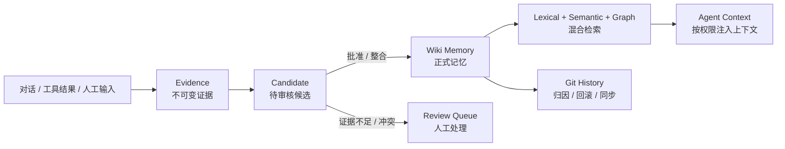
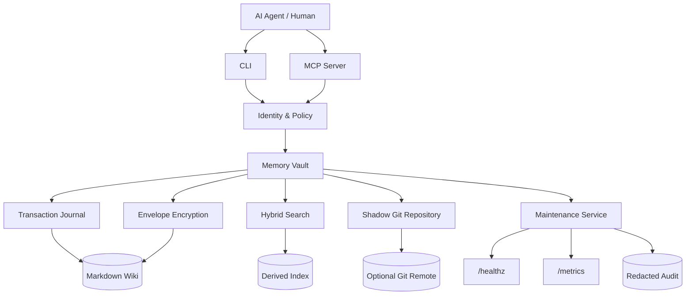

<div align="center">


# MemoBranch

### Memory that branches with your agents.

让 AI Agent 拥有可审计、可检索、可迁移的长期记忆

**Markdown 是事实源 · Git 记录每次演化 · LLM 只做可选增强**

<p>
  
  
  
  
  
  <a href="https://github.com/sens-io/memobranch/actions/workflows/ci.yml"></a>
  
  
  <a href="https://github.com/sens-io/memobranch/stargazers"></a>
</p>

<p>
  <a href="#-为什么需要它">为什么</a> •
  <a href="#-核心能力">核心能力</a> •
  <a href="#-快速开始">快速开始</a> •
  <a href="#-工作原理">工作原理</a> •
  <a href="#-mcp-接入">MCP 接入</a> •
  <a href="#-生产运维">生产运维</a>
</p>

</div>

---

MemoBranch 是一个面向 AI Agent 的生产级、本地优先长期记忆层。它把对话中的证据、候选知识和正式记忆组织成一套可人工阅读的 Markdown Wiki，并用 Git 提供版本、归因、回滚与跨机器同步。

它借鉴 [OpenKnowledge](https://github.com/inkeep/open-knowledge) 的 Git + LLM Wiki 思路并独立实现，不包含其源码。生产版采用 [OpenSpec](https://github.com/Fission-AI/OpenSpec) 的 proposal → specs → design → tasks → implementation → verification 工作流完成。

> [!IMPORTANT]
> LLM 不是数据源。即使没有模型 API，捕获、审核、Git 版本、恢复、中文/英文检索和 MCP 接入仍然可以完整工作。

## 💡 为什么需要它

普通 Agent 记忆常常只有一个向量库：内容从哪里来、为什么可信、谁修改过、冲突如何处理，都很难回答。

MemoBranch 把记忆变成一条可治理的知识链：



| 常见问题 | MemoBranch 的处理方式 |
| --- | --- |
| “这条记忆从哪里来？” | 每条正式记忆保留证据引用和 Git 历史 |
| “新信息和旧信息冲突怎么办？” | 进入审核队列，不静默覆盖 |
| “Agent 能不能自己声明管理员权限？” | 不能，身份与权限由服务端配置决定 |
| “秘密会不会进 Git 或向量库？” | 敏感内容信封加密，并排除出持久化索引和生成文件 |
| “写到一半进程崩了怎么办？” | 写前事务日志支持精确回滚或完整重放 |
| “模型 API 挂了还能搜索吗？” | 自动降级到确定性的中英文词法检索 |

## ✨ 核心能力

| | 能力 | 说明 |
| :---: | --- | --- |
| 📚 | **Git-native Wiki** | Markdown 是权威数据；每次逻辑变更都有身份归因的 Git 提交 |
| 🧾 | **证据驱动记忆** | `evidence → candidates → wiki`，保留来源、置信度、条件与修订链 |
| 🛡️ | **服务端访问控制** | 按 permission、scope、sensitivity、tenant 在读取内容前授权 |
| 🔐 | **机密信封加密** | `sensitive` / `secret` 使用每记录 DEK + AES-256-GCM，并支持密码学擦除 |
| 🔎 | **混合检索** | CJK/英文词法检索、可选 embeddings、Wiki 链接扩展与增量索引 |
| 🔄 | **远端 Git 同步** | ahead/behind/diverged 状态、快进、常规合并、冲突中止和受控推送 |
| 🧯 | **崩溃恢复** | 多文件写入先 journal，再原子替换；启动后自动回滚或重放 |
| 🔌 | **CLI + MCP** | 稳定 JSON、类型化错误、有限输入、最小权限工具契约 |
| 📈 | **生产可观测性** | 单实例维护服务、`/healthz`、Prometheus `/metrics`、脱敏审计 |
| 🧩 | **OpenSpec 驱动** | 6 个正式规格、25 条规范要求、27/27 实现任务均已归档 |

> [!NOTE]
> 当前定位是“一租户一个 vault”的本地服务。它不包含浏览器编辑器、托管控制面、多租户数据库、分布式写入共识或自动语义冲突裁决。

## 🚀 快速开始

### 环境要求

- Node.js 20 或更新版本
- 可从 `PATH` 调用的 Git

### 安装

```bash
git clone https://github.com/sens-io/memobranch.git
cd memobranch
npm ci
npm run build
npm link
```

### 60 秒创建第一条记忆

```bash
# 1. 创建 vault
amem init ~/my-agent-memory --name personal-agent --json

# 2. 捕获原始证据
amem capture "请记住：默认用中文简洁回答" \
  --root ~/my-agent-memory \
  --scope user \
  --sensitivity internal \
  --json

# 3. 创建一个可审核候选
amem propose "用户偏好简洁的中文回答。" \
  --root ~/my-agent-memory \
  --key "回答语言与风格" \
  --kind preference \
  --scope user \
  --confidence 0.95 \
  --explicit \
  --json

# 4. 按策略整合为正式 Wiki 记忆
amem consolidate --root ~/my-agent-memory --json

# 5. 检索并生成 Agent 上下文
amem search "用户喜欢怎样的回答" --root ~/my-agent-memory --json
amem context "如何回复这个用户" --root ~/my-agent-memory
```

检查运行状态：

```bash
amem doctor --root ~/my-agent-memory --json
```

## 🏗️ 工作原理

### 系统架构



### Vault 数据布局

```text
vault/
├── agent-memory.json       # v2 配置
├── AGENTS.md               # Agent 使用约束
├── evidence/               # 不可变原始证据
├── candidates/             # 待审核候选
├── wiki/                   # 正式记忆
├── MEMORY.md               # 非机密常驻卡片（自动生成）
├── INDEX.md                # 非机密目录（自动生成）
├── log.md                  # 不含正文的 Git 审计摘要
└── .amem/
    ├── git/                # shadow Git 元数据
    ├── keys.json           # wrapped data keys，不进入 Git
    ├── transactions/       # 写前事务日志
    ├── search-index.json   # 可重建词法索引，不进入 Git
    ├── embeddings.json     # 可重建向量缓存，不进入 Git
    ├── audit.jsonl         # 结构化脱敏审计
    └── metrics.json        # 有界计数器与仪表
```

### 记忆治理规则

- `evidence/` 只追加原始证据，稳定哈希避免重复捕获。
- `candidates/` 保存提炼后的待审核知识；冲突和低置信内容不会自动进入正式记忆。
- `wiki/` 只保存审核后的正式记忆，是检索和上下文生成的权威来源。
- `procedure` 默认至少需要两份证据。
- 同一 `scope + kind + key` 的不同内容会形成显式冲突。
- 普通检索不会返回 `conflicted` 记录；拒绝最后一个冲突候选会恢复原正式记忆。
- LLM 提炼结果继承 evidence 的 scope，且敏感级别只能提高、不能降低。
- `forget` 是保留历史的可审计撤销；`erase` 额外销毁本地 wrapped data key。

## 🔍 搜索与 LLM 增强

基础检索无需任何模型：系统会对拉丁词、中文字符和 CJK bigram 建立持久化增量索引，并保证相同 vault 的排序可重复。

配置 OpenAI 兼容接口后，可以开启自动提炼、基于记忆问答和语义检索：

```bash
export AMEM_LLM_API_KEY="..."
export AMEM_LLM_MODEL="gpt-4.1-mini"
export AMEM_LLM_BASE_URL="https://api.openai.com/v1"

amem capture "请记住：默认用中文简洁回答" \
  --extract \
  --root ~/my-agent-memory \
  --json

amem ask "我应该如何回复？" --root ~/my-agent-memory --json
```

在 `agent-memory.json` 的 `index.embeddingModel` 中配置向量模型后：

```bash
amem reindex --semantic --root ~/my-agent-memory --json
amem search "回答偏好" --semantic --root ~/my-agent-memory --json
```

向量服务不可用时，请求仍会返回词法和图关系结果，并报告 `semanticStatus: "degraded"`。只有非机密正式 Wiki 页面会发送到 embedding API。

## 🔐 安全与机密记忆

### 信封加密

首次读写 `sensitive` 或 `secret` 记录前，提供一个 32 字节 master key：

```bash
export AMEM_MASTER_KEY="$(openssl rand -hex 32)"

amem capture "仅授权 Agent 可见的机密内容" \
  --root ~/my-agent-memory \
  --sensitivity secret \
  --json
```

每条机密记录使用独立数据密钥，完整逻辑元数据和正文都经过 AES-256-GCM 认证加密。Git 跟踪文件只保留最小非敏感信封。

> [!WARNING]
> 不要把 `AMEM_MASTER_KEY` 写进仓库、配置、远端 URL 或 shell 历史。生产环境应通过操作系统密钥链、secret manager 或安全的进程注入提供。

密钥恢复注意事项：

- `.amem/keys.json` 保存由 master key 包装的数据密钥，不会通过 Git 同步。
- 跨主机读取机密记忆时，需要单独、安全地迁移 master key 与 `.amem/keys.json`。
- 丢失任意一项都会使对应历史密文不可恢复。
- `erase` 只能保证本 vault 不再具备解密能力，不能删除外部备份、已导出明文或第三方副本。
- 机密记录不会进入 `MEMORY.md`、`INDEX.md`、持久化索引、向量 API、审计正文或指标标签。

### 权限模型

MCP 主体完全由服务端环境构造，调用者不能通过工具参数伪造身份或提升权限。

| 权限 | 用途 |
| --- | --- |
| `read` | 检索、读取与上下文生成 |
| `write` | 捕获证据、创建候选 |
| `review` | 整合、批准、拒绝与撤销 |
| `sync` | 远端状态与同步 |
| `maintain` | 恢复、索引、健康检查与守护服务 |
| `admin` | 包含全部权限，并允许密码学擦除 |

授权会同时检查 `scope`、最高 `sensitivity` 与可选 `tenantId`，并且发生在解密、评分、图扩展、摘要生成和 embedding 请求之前。

## 🔌 MCP 接入

构建完成后，把以下配置加入支持 MCP 的 Agent 工具。请将路径替换为实际绝对路径：

```json
{
  "mcpServers": {
    "agent-memory": {
      "command": "node",
      "args": [
        "/absolute/path/to/memobranch/dist/mcp.js",
        "/absolute/path/to/memory-vault"
      ],
      "env": {
        "AMEM_ACTOR_ID": "workspace-agent",
        "AMEM_ACTOR_NAME": "Workspace Agent",
        "AMEM_PERMISSIONS": "read,write,review",
        "AMEM_ALLOWED_SCOPES": "user,project",
        "AMEM_MAX_SENSITIVITY": "internal"
      }
    }
  }
}
```

### MCP 工具

| 类别 | 工具 |
| --- | --- |
| 写入 | `memory_capture`, `memory_propose` |
| 检索 | `memory_search`, `memory_context`, `memory_get` |
| 审核 | `memory_consolidate`, `memory_review`, `memory_forget`, `memory_erase` |
| 运维 | `memory_doctor`, `memory_recover`, `memory_reindex`, `memory_maintenance` |
| Git | `memory_history`, `memory_remote_status`, `memory_remote_sync` |
| 信息 | `memory_version`, `memory_config`, `memory_policy` |

所有 MCP 错误都使用稳定错误码和 `isError: true` 返回，不暴露堆栈或秘密，也不会终止服务器。建议 Agent 在处理依赖长期上下文的任务前调用 `memory_context`。

## 🌐 远端 Git 同步

远端认证完全委托给 Git credential helper 或 SSH agent。CLI 和 MCP 不接受 token 参数；带 userinfo、query、fragment 或非 `git` SCP 用户名的 URL 都会被拒绝。

```bash
amem remote set git@github.com:org/memory-vault.git \
  --root ~/my-agent-memory \
  --name origin \
  --branch main \
  --json

amem remote status --root ~/my-agent-memory --json
amem remote sync --root ~/my-agent-memory --push --json
```

同步顺序：恢复未完成事务 → 检查工作树 → fetch → 计算 ahead/behind → 快进或常规 merge → 重建派生状态 → 健康校验 → 可选 push。

发生内容冲突、后置校验失败或 push 失败时，系统会保留错误信息并恢复同步前的本地 HEAD、受管工作树和同步状态，不会自动强推。

## 🩺 生产运维

### 一次性维护

```bash
amem maintenance --root ~/my-agent-memory --json
```

一次维护周期依次执行事务恢复、到期处理、增量索引、健康检查和可选远端同步。相同状态下重复运行不会产生无意义 Git 提交。

### 长期服务

```bash
amem serve \
  --root ~/my-agent-memory \
  --host 127.0.0.1 \
  --port 9464

curl http://127.0.0.1:9464/healthz
curl http://127.0.0.1:9464/metrics
```

- HTTP 服务只接受回环地址。
- `.amem/service.json` 维护单实例租约，存活进程不会被抢占。
- 受管目录变更会防抖后触发增量索引；原生文件监听不可用时自动降级为有界轮询。
- `SIGTERM` / `SIGINT` 会等待正在执行的事务安全结束。
- 最近一次 `doctor` 不健康或维护周期失败时，`/healthz` 返回 HTTP 503 和 `status: "unavailable"`。
- 指标采用固定名称和有界标签，不包含正文、密钥、凭据或源 URI。

建议使用 systemd、launchd 或容器编排器管理进程，并通过安全环境注入配置。

<details>
<summary><strong>环境变量参考</strong></summary>

| 变量 | 含义 | 默认值 |
| --- | --- | --- |
| `AMEM_VAULT` | MCP vault 路径 | 当前目录 |
| `AMEM_ACTOR_ID` | Git 与审计主体 ID | `agent` |
| `AMEM_ACTOR_NAME` | Git 与审计主体名称 | 主体 ID |
| `AMEM_ACTOR_EMAIL` | 可选 Git 邮箱 | 空 |
| `AMEM_PERMISSIONS` | 权限列表 | MCP 默认为 `read` |
| `AMEM_ALLOWED_SCOPES` | 允许的 scope 列表 | 全部 |
| `AMEM_MAX_SENSITIVITY` | 最高敏感级别 | `internal` |
| `AMEM_TENANT_ID` | 可选 vault 租户绑定 | 空 |
| `AMEM_MASTER_KEY` | 信封加密 master key | 空，机密操作失败关闭 |
| `AMEM_LLM_API_KEY` | OpenAI 兼容 API 凭据 | 空 |
| `OPENAI_API_KEY` | `AMEM_LLM_API_KEY` 的兼容来源 | 空 |
| `AMEM_LLM_MODEL` | 提炼与问答模型 | `gpt-4.1-mini` |
| `AMEM_LLM_BASE_URL` | OpenAI 兼容 API 根地址 | `https://api.openai.com/v1` |
| `AMEM_EMBEDDING_MODEL` | 可选向量模型 | 空，仅词法检索 |
| `AMEM_LLM_TIMEOUT_MS` | 单次 provider 请求总超时 | `30000` |
| `AMEM_LLM_MAX_RESPONSE_BYTES` | provider 最大响应字节数 | `2000000` |
| `AMEM_LLM_MAX_RETRIES` | 429/5xx/网络失败的有限重试次数 | `1` |

完整示例见 [`.env.example`](./.env.example)。

</details>

<details>
<summary><strong>故障恢复 Runbook</strong></summary>

1. 停止所有写入者和守护进程，保留完整 vault 与 `.amem/` 副本。
2. 运行 `amem doctor --root <vault> --json`，记录配置、Git、索引和事务状态。
3. 运行 `amem recover --root <vault> --json`；`writing` 事务回滚，`ready` 事务完整重放并提交。
4. 运行 `amem reindex --root <vault> --json`，从 Markdown 重建缺失或损坏索引。
5. 运行 `amem remote status --root <vault> --json`；出现 divergence 时人工检查，不绕过保护强推。
6. 再次运行 `doctor`，仅在 `healthy: true` 后恢复服务和自动同步。

Git 对象损坏时，同步会被禁止。应从可信远端或备份恢复 `.amem/git`，不要删除工作树中的 Markdown 权威数据。master key 或 wrapped key 丢失时系统会失败关闭，请从受控密钥备份恢复。

</details>

## ⌨️ CLI 速查

| 任务 | 命令 |
| --- | --- |
| 初始化 | `amem init [path] [--name NAME]` |
| 捕获 / 提炼 | `amem capture <text\|-> [--extract]` / `amem extract <evidence-id>` |
| 候选 | `amem propose <statement> --key KEY` |
| 审核 | `amem consolidate` / `approve` / `reject` |
| 遗忘 / 擦除 | `amem forget <id\|key>` / `amem erase <id\|key>` |
| 检索 / 上下文 | `amem search <query>` / `context` / `ask` / `get` |
| 诊断 / 恢复 | `amem doctor` / `recover` / `reindex` / `maintenance` |
| 远端 | `amem remote set` / `status` / `sync` / `remove` |
| 服务 | `amem serve [--host 127.0.0.1] [--port 0]` |
| 信息 | `amem version` / `config` / `policy` / `history` |

所有命令都支持 `--root PATH`；自动化场景建议统一使用 `--json`。

## 🔁 v1 → v2 迁移

```bash
amem config migrate --root ~/my-agent-memory --json
```

迁移会先创建 `agent-memory.json.v1.bak`，再加入租户、权限、索引、远端、维护和限制配置。已有机密明文只有在显式迁移且提供 `AMEM_MASTER_KEY` 时才会被重写为加密信封。

遇到未来版本配置时，`doctor` 仍可提供只读诊断，但所有写入都会以 `CONFIG_VERSION_UNSUPPORTED` 失败关闭。

## 🧪 开发与发布门禁

```bash
npm run check
npm pack --dry-run
npm audit --omit=dev
OPENSPEC_TELEMETRY=0 openspec validate --all --strict
```

| Gate | 当前状态 |
| --- | :---: |
| TypeScript build | ✅ PASS |
| CLI / MCP / Vault tests | ✅ 38 / 38 |
| 1,000 文档索引性能门禁 | ✅ PASS |
| npm package dry-run | ✅ PASS |
| 依赖漏洞审计 | ✅ 0 known vulnerabilities |
| OpenSpec strict validation | ✅ 7 / 7 items |

测试覆盖权限与租户拒绝、LLM 机密降级、机密信封与可恢复擦除、事务回滚/重放、长时活锁、索引篡改、证据改写、冲突闭环、CJK 检索、热查询、provider 超时/取消/响应上限、远端配置补偿、同步失败回滚，以及维护服务端点与优雅关闭。

规格与归档记录位于 [`openspec/`](./openspec)，本轮独立审计修复及验证证据见 [`production-audit-remediation`](./openspec/changes/production-audit-remediation)。

## 🧱 威胁模型与边界

**本实现防护：** MCP 调用者伪造身份、越权 scope/sensitivity 访问、机密明文进入 Git/索引/日志/指标、部分写入、重复执行、远端 URL 凭据落盘、常见同步冲突和模型服务不可用。

**本实现不防护：** 已完全控制本机或进程内存的攻击者、恶意本机管理员、已导出明文、操作系统或备份泄漏、Git/LLM 供应链失陷、流量分析，以及第三方已经持有副本的删除。

生产部署仍需配合磁盘加密、最小文件权限、进程隔离、密钥轮换、受控备份和供应链扫描。

## 🙏 致谢

- [OpenKnowledge](https://github.com/inkeep/open-knowledge)：Git 驱动的本地 Markdown / LLM Wiki 架构灵感。
- [OpenSpec](https://github.com/Fission-AI/OpenSpec)：规格驱动的生产开发与归档流程。
- [Model Context Protocol](https://modelcontextprotocol.io/)：Agent 与记忆服务之间的标准工具接口。

---

<div align="center">

**Built for agents that should remember — without forgetting where the truth came from.**

MIT License · Local-first · Git-native

</div>
